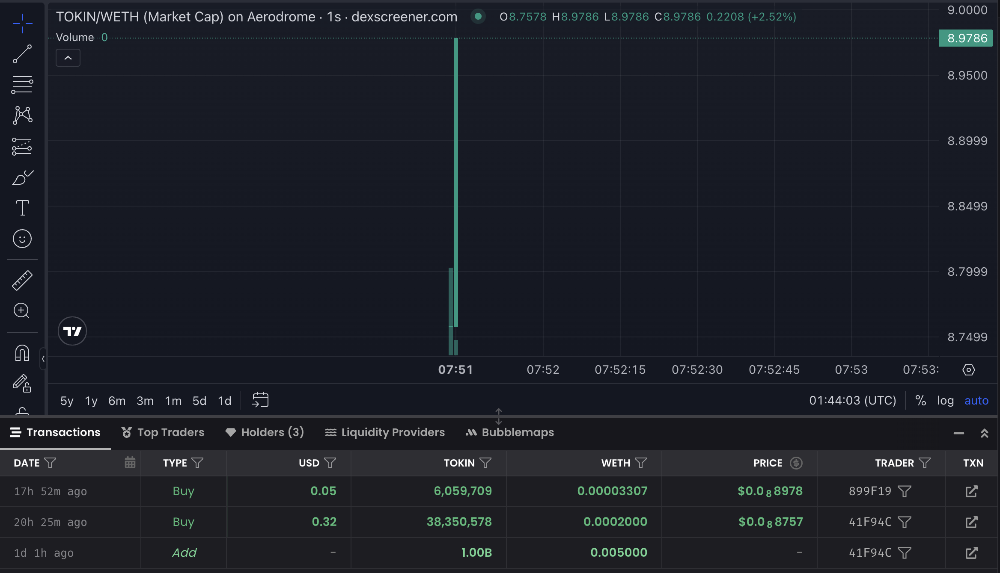
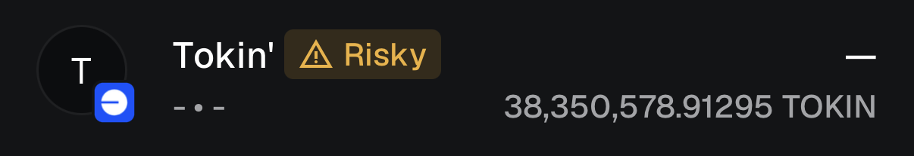
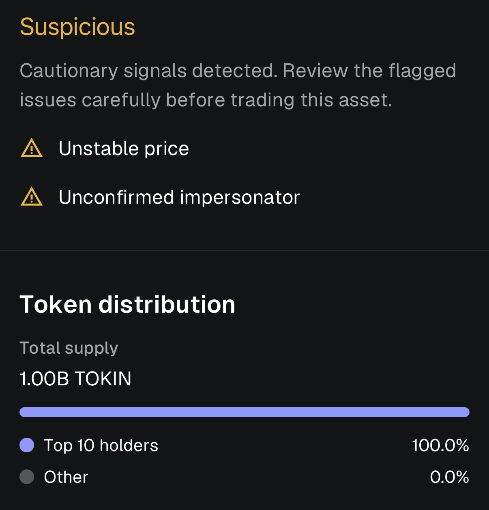

# Tokin' on Base

This repo documents in detail the "fair launch" of a meme coin on **Base**, an Ethereum L2 blockchain. It is a sibling project to https://github.com/rankoau/obstok. It turned out to be a *very different project* to OBSTOK.

Examine its (virtually non-existent) activity: [DEX Screener](https://dexscreener.com/base/0x168a0f0f7bE446F67FfE98FfBd98db4251F82740) / [Birdeye](https://birdeye.so/base/token/0x615288abCF1B9A08EF6680F0D592B4155D9eEd8f).

Tokin' is deemed to be [low risk of being a honeypot](https://honeypot.is/base?address=0x615288abCF1B9A08EF6680F0D592B4155D9eEd8f)! Nice!

## Process

At a very high level, here is how an EVM meme coin launch works in 2026 (more detail in [/docs](docs/)):

1. **Write** (and test) an [ERC-20](https://ethereum.org/developers/docs/standards/tokens/erc-20/) token contract inheriting from a battle-tested open-source implemention. For a token that can essentially be minted, held, transferred and swapped on a DEX, there is virtually nothing novel to implement.

2. **Deploy the token contract** on an EVM blockchain network. The contract's constructor automatically mints the full supply, and cannot be invoked more than once.

3. **Seed a volatile liquidity pool** on a DEX like Uniswap v2 or Aerodrome in exchange for liquidity provider (LP) tokens, enabling swaps between the new token and a conventional pairing (typically either wrapped Ether or a USD stablecoin)

4. **Burn the LP tokens** by sending them to a canonical unrecoverable blockchain address (one with no possible private key), so the fact that they were burned is permanently visible and trivial to check.

5. **Formally verify** the contract by publishing the source code and constructor arguments, allowing it to be recompiled by third parties and compared to the on-chain bytecode. This is an important trust signal for swap venues and honeypot scanners especially.

6. **Deploy collateral** (metadata, logo, website) and register its existence with wallets, swap venues, block explorers etc. Importantly, there is no automatic link between a token's contract and its logo image.

Meme coins like this never appear on reputable centralised exchanges unless they manage to garner significant trading volume as the result of promotional/communal activity; moreover, a token with a thin liquidity pool will be automatically deemed high-risk and largely suppressed in relevant user interfaces.

