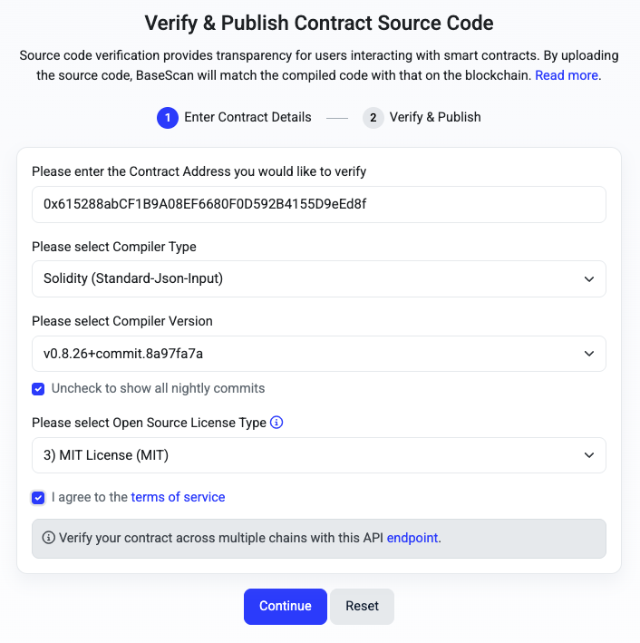
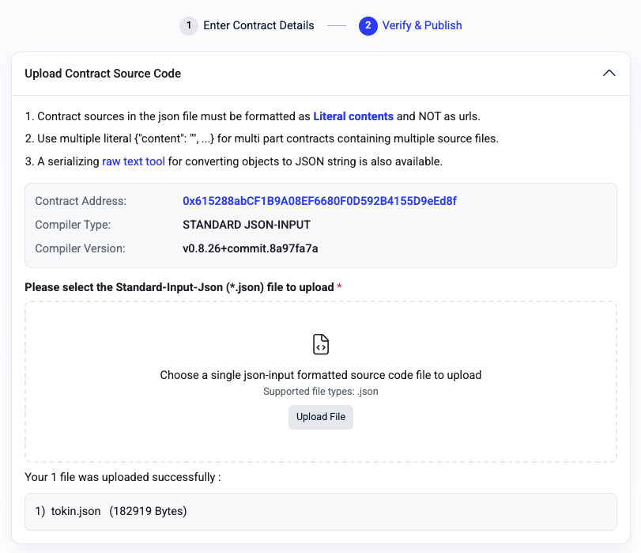
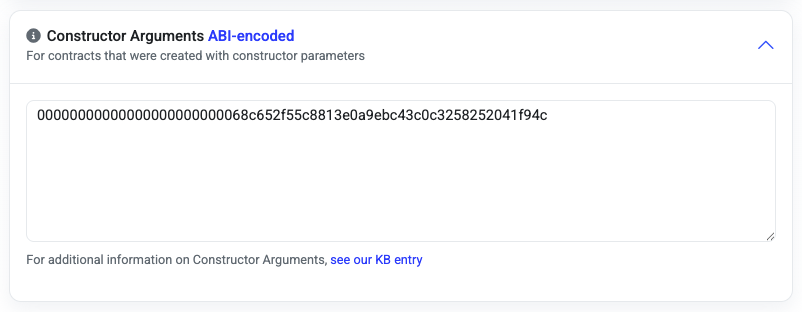
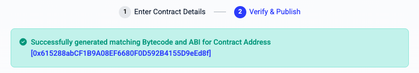
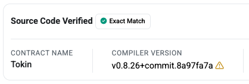

# Launching a meme coin

This document was assembled while working through the process end-to-end.

## Upfront decisions

| Decision | Choice | Rationale |
|---|---|---|
| Chain | **Base (Ethereum L2)** | Strongest memecoin culture of any L2 due to  |
| Name | **Tokin'** | A joke about a koala with unfettered access to gumleaves |
| Symbol (ticker) | **TOKIN** | Not taken according to etherscan.io
| Token standard | **ERC-20** (OpenZeppelin v5) | Simple and universally supported by wallets etc. |
| Base asset | **(W)ETH** | Most natural option for swaps. All ETH in Uniswap v2-style pools use Wrapped ETH (WETH), because the pools only work with ERC-20 tokens. |
| DEX | **Aerodrome** | Uniswap v2-style DEX most suitable on Base for constant-product automated market maker deployments (cpAMM) |
| Liquidity locking | **Burn to `0x...dEaD`** | Purity, stronger trust signal than time-locking or using `address(0)`. |
| Total supply | **1 Billion** | A conventional amount for a memecoin supply. |
| Seed liquidity | **0.005 ETH** | Around $10-20 (AUD), throwaway amount, enough to observe the pricing mechanics | 

## Install Foundry

[Foundry](https://www.getfoundry.sh/) is one of the two major development toolchains in the EVM ecosystem, along with [Hardhat](https://v2.hardhat.org/). Fetch and run the installer script:

```bash
curl -L https://foundry.paradigm.xyz | bash
```

Then run the installer itself:

```bash
foundryup
```

Check that the four Foundry tools are installed correctly:

```bash
forge --version # for building/testing/deploying smart contracts
cast --version # for transacting/querying on blockchains
anvil --version # for running a local Ethereum node
chisel --version # REPL for Solidity development
```

## Initialise the repo

Make sure the project's *root* is initialised with `git init`. Then, in the root folder:

```bash
forge init contracts/
```

This creates a standard Foundry project layout in a `contracts` subdirectory, adjacent to other folders for `docs`, `metadata` etc.

> [!WARNING]
> From this point onward, all `forge` commands must be run from inside the `contracts` folder.

Install the latest OpenZeppelin contract collection as a additional dependency alongside the forge standard library:

```bash
cd contracts
forge install OpenZeppelin/openzeppelin-contracts@v5.6.1
```

Write an explicit `remappings.txt` to ensure that both `forge` and IDE plugins understand `@openzeppelin/*` import paths:

```bash
forge remappings > remappings.txt
```

Update the default `foundry.toml` configuration to explicitly set the Solidy compiler version and avoid a bunch of deprecation warnings:

```bash
[profile.default]
src = "src"
out = "out"
libs = ["lib"]
solc = "0.8.26"
```

Verify that the initialised project builds with no `solc` compiler warnings:

```bash
forge build
```

## Write the contract

All EVM fungible tokens conform to the long-established [ERC-20](https://ethereum.org/developers/docs/standards/tokens/erc-20/) standard. The standard defines the *interface* (`IERC20.sol`); while [OpenZeppelin](https://github.com/openzeppelin/openzeppelin-contracts) (a leading blockchain security company) provides a battle-tested *abstract implementation* (`ERC20.sol`) designed to be inherited from. Ultimately, a straight meme coin implementation contains nothing novel that OZ's v5 implementation doesn't do already except for minting its own supply from the constructor. Otherwise all that is required is to customise the name and ticker symbol.

(See [`/contracts/src/Tokin.sol`](../contracts/src/Tokin.sol))

> [!NOTE]
> `ERC20Permit` is the EIP-2612 extension to ERC-20 which was introduced to allow for approvals via off-chain signatures. ERC-20 works without it, but all basic tokens use this now because it makes using the token cheaper.

```bash
forge build # should be clean
```

## Write tests

This is an academic exercise, since OpenZeppelin's ERC20 implementations already have thorough coverage. Test suite files always use the `.t.sol` suffix by convention. They execute on Foundry's modified version of the EVM, which contains harness features like "off-chain" transaction signing and the ability to modify the source address of contract function calls.

(See [`/contracts/test/Tokin.t.sol`](../contracts/test/Tokin.t.sol)):

```bash
forge test -vvv # should be all green
```

## Create gas snapshot

```bash
forge snapshot # commit the resulting .gas-snapshot file
```

This command runs the test suite and logs the gas consumption for each test. It provides a record for the future detection of potentially costly performance regression due to refactors or dependency upgrades. Later, the `--check` and `--tolerance` flags (the latter for fuzz tests) can be used in CI jobs to ensure that unintended changes to the gas profile are caught prior to deployment.

## Configure RPC provider endpoints

In `contracts/foundry.toml`, set the URLs of the Base `mainnet` and `local` JSON-RPC endpoints (the latter will be used for staging rather than the Sepolia `testnet`, which will make sense later). [mainnet.base.org](https://mainnet.base.org) is free and requires zero setup. It is also rate-limited and occasionally flaky.

```bash
[rpc_endpoints]
base = "https://mainnet.base.org"
local = "http://127.0.0.1:8545"
```

> [!NOTE]
> This setting is read by the `forge` and `cast` commands, but it is **not** read by `anvil`.

## Write deployment scripts

There are plenty of ways to actually transact on EVM blockchains, but the most convenient and type-safe is to use Foundry's own scripting setup. The code is executed on an equivalent virtual machine to that of the destination blockchain itself.

For a meme coin deployment there are three short scripts needed:

1. [`/contracts/script/Deploy.s.sol`](../contracts/script/Deploy.s.sol) to create the token contract
2. [`/contracts/script/SeedPool.s.sol`](../contracts/script/SeedPool.s.sol) to setup the liquidity pool on Aerodrome
3. [`/contracts/script/BurnLP.s.sol`](../contracts/script/BurnLP.s.sol) to burn the liquidity provider tokens (making a "rug pull" impossible)

**(1)** simply creates the token and logs its address. **(3)** relies on the fact that the liquidity provider tokens are *also* ERC-20 tokens, whose interface is already installed as part of the OpenZeppelin library.
**(2)** requires *just the interfaces* for the relevant Aerodrome smart contracts. `cast interface` can generate these from ABI definitions fetched from the official source, but it requires an [etherscan.io](etherscan.io) API key, and unfortunately Base is [not in the free tier](https://docs.etherscan.io/supported-chains). Fortunately it is possible to simply copy from the published source code on [basescan.org](basescan.org) instead:

- [`/contracts/script/interface/aerodrome/IPoolFactory.sol`](/contracts/script/interface/aerodrome/IPoolFactory.sol)
- [`/contracts/script/interface/aerodrome/IRouter.sol`](/contracts/script/interface/aerodrome/IRouter.sol)

## Configure deployer wallets

### local

Use the standard key for Anvil's account `0` (it is the same for everybody's instance of Anvil):

```bash
cast wallet import tokin-local --private-key 0xac0974bec39a17e36ba4a6b4d238ff944bacb478cbed5efcae784d7bf4f2ff80
```

The `import` command above creates a `tokin-local` keystore file in `~/.foundry/keystores/`, which is used later by `forge script`'s `--account` option to determine which address to use as the deployer.

> [!WARNING]
> The `--private-key` option is only suitable for local testing using publicly-known private keys like this.

### mainnet

Create a dedicated key pair for deployment on the Base mainnet:

```bash
cast wallet new ~/.foundry/keystores tokin-mainnet
```

Verify the setup:

```bash
cast wallet list
# 0xtokin-local (Local)
# 0xtokin-mainnet (Local)
```

## Spin up a local blockchain fork

```bash
anvil --fork-url https://mainnet.base.org --chain-id 8453
```

This command launches a single-node instance of the Base network. The local chain's genesis block is "pinned" to the most recent block on the real blockchain. It then forwards state reads to the remote RPC and caches them locally; new transactions build on top without ever touching the real network. This technique provides much stronger guarantees than Sepolia testnets when *you do not control the contracts*: current bytecode and addresses are read directly from mainnet, whereas on a testnet they are frequently out of date; many projects do not maintain a testnet presence at all.

A couple of sense checks once it's running:

```bash
cast chain-id --rpc-url local # should return the Base chain ID of 8453
cast block-number # should return the latest block number
```

Compare the output of the second command to the block number reported by https://basescan.org/. Base produces new blocks every 2 seconds.

## Perform a local dry run

Run the three scripts in sequence to simulate the complete launch against the local Anvil instance. In each case, the sender is the standard public address for Anvil account `0` – the same for all Anvil instances.

### Deploy the Tokin' contract (local)

```bash
forge script script/Deploy.s.sol --rpc-url local --broadcast --account tokin-local --sender 0xf39fd6e51aad88f6f4ce6ab8827279cfffb92266
```

> [!TIP]
> `forge` will fail if `--sender` and `--account` do not produce a matching keypair. If `--sender` is omitted it will first decrypt the account file to derive the public key; however, being explicit is a guardrail to reduce the likelihood of accidentally transacting from the wrong address.

Note the `console.log` output containing the address of the deployed token contract:

```
== Logs ==
Tokin deployed at: 0x1bC5CD3Bb2989Cb1Fd09967Ebe590563e0478E51 # for example
```

This value is needed for the following scripts: write it to [`/contracts/.env`](/contracts/.env):

```
TOKIN_ADDRESS=0x1bC5CD3Bb2989Cb1Fd09967Ebe590563e0478E51
```

### Seed the Aerodrome liquidity pool (local)

```bash
forge script script/SeedPool.s.sol --rpc-url local --broadcast --account tokin-local --sender 0xf39fd6e51aad88f6f4ce6ab8827279cfffb92266
```

Note the `console.log` output containing the address of the liquidity provider (LP) token:

```
== Logs ==
Pool / LP token address: 0xa203bf6E5dF68a5701741A4A052385D67d1D5a05 # for example
TOKIN' deposited: 1000000000000000000000000000
WETH deposited: 5000000000000000
LP minted to deployer: 2236067977499789695409
```

Some interesting things to note:
- In Aerodrome/Uniswap v2 scenarios, the Pool (AMM) and the ERC-20 LP token are the same contract.
- Even though ETH was sent with the contract invocation to fund the liquidity, it is technically *wrapped* ETH (WETH) that gets deposited in the pool, because both sides of the equation must be ERC-20 tokens.
- The amounts are expressed in their base denominations (i.e. it is *technically* 5e15 "wrapped Wei")
- The amount of LP minted is `floor(sqrt(reserveTOKIN × reserveETH)) − MINIMUM_LIQUIDITY`, i.e. `sqrt(1e27 × 5e15) − 1000` – the geometric mean of the two reserves minus a tiny amount serving as an anti-manipulation mechanism against nefarious minters (the mathematical reasoning is confusing but sound when you read up on it).
- The amount ETH sent to the pool did *not* include the gas cost incurred by the transaction. Slightly more than 0.005 ETH was spent.

Add the value LP token address to [`/contracts/.env`](/contracts/.env) for use in the next step:

```
LP_TOKEN_ADDRESS=0xa203bf6E5dF68a5701741A4A052385D67d1D5a05
```

### Burn the LP tokens (local)

```bash
forge script script/BurnLP.s.sol --rpc-url local --broadcast --account tokin-local --sender 0xf39fd6e51aad88f6f4ce6ab8827279cfffb92266
```

The `console.log` output confirms the burn:

```
== Logs ==
Burned LP amount: 2236067977499789695409
Deployer LP remaining: 0
Burn address LP held: 2236067977499789695409
```

## Fund the deployer wallet

Double-check the deployer's mainnet address previously created by `cast wallet new`:

```bash
cast wallet address --account tokin-mainnet
```

Send 0.0005 ETH to this address as a test (from a personal wallet or CEX app), then check its balance to confirm the address was handled correctly:

```bash
cast balance <MAINNET_DEPLOYER> --rpc-url base --ether # 0.000500000000000000
```

Once confirmed, send another ~0.01 ETH to fund the token launch.

## Deploy the Tokin' contract (mainnet)

```bash
forge script script/Deploy.s.sol --rpc-url base --broadcast --account tokin-mainnet --sender <MAINNET_DEPLOYER>
```

Note the script's `console.log` output:

```
== Logs ==
Tokin' deployed at: 0x...
```

Set the new Tokin' contract mainnet address in `/contracts/.env` for use by the `SeedPool` script:

```
TOKIN_ADDRESS=0x...
```

## Seed the Aerodrome liquidity pool (mainnet)

```bash
forge script script/SeedPool.s.sol --rpc-url base --broadcast --account tokin-mainnet --sender <MAINNET_DEPLOYER>
```

Note the script's `console.log` output:

```
== Logs ==
Pool / LP token address: 0x...
TOKIN' deposited: 1000000000000000000000000000
WETH deposited: 5000000000000000
LP minted to deployer: 2236067977499789695409
```

Set the mainnet Pool / LP token address in `/contracts/.env` for use by the `BurnLP` script:

```
LP_TOKEN_ADDRESS=0x...
```

## Burn the LP tokens (mainnet)

```bash
forge script script/BurnLP.s.sol --rpc-url base --broadcast --account tokin-mainnet --sender <MAINNET_DEPLOYER>
```

Confirm the burn in the script's `console.log` output:

```
== Logs ==
Burned LP amount: 2236067977499789695409
Deployer LP remaining: 0
Burn address LP held: 2236067977499789695409
```

## Verify the contract with Sourcify

Contract verification refers to the reconciliation, by a trusted third party, of the contract's deployed bytecode with its claimed source code. Projects that fail to do this are often flagged as honeypots. For EVM blockchain contracts this activity is relatively fragmented – there is no central regime/protocol through which parties share verification statuses for addresses, and so there are numerous avenues the developer must pursue in order to maximise trust in a new token across the chain's ecosystem (wallets, explorers, swap venues, etc.)

At time of writing, the only way to *automate* this for free is by using [Sourcify](https://sourcify.dev/), which is now thankfully the default option for the `forge verify-contract` command. Other methods require API keys associated with paid subscriptions.

First, generate the Tokin' constructor call with the deployer's address: 

```bash
cast abi-encode "constructor(address)" <MAINNET_DEPLOYER> # with the 0x dropped
# e.g. -> 0x00000000000000000000000068c652f55c8813e0a9ebc43c0c3258252041f94c
```

Next, run the contract verification command. This will use Sourcify to verify and publish the source code to various registries, but importantly it does **not** publish to BaseScan.

```bash
forge verify-contract <TOKIN_ADDRESS> src/Tokin.sol:Tokin --chain base --constructor-args 0x000...94c --watch
```

Verification should take up to 30 seconds, and complete with this output:

```
...
Contract successfully verified:
Status: `exact_match`
```

## Verify the contract on BaseScan

Verification on [basescan.org](https://basescan.org) can still be done for free, but it is a manual process via a web form. Firstly, a magic JSON specification needs to be dumped to a file for upload:

```bash
forge verify-contract 0x0000000000000000000000000000000000000000 src/Tokin.sol:Tokin --show-standard-json-input > tokin.json
```

> [!NOTE]
> The `verify-contract` command *always* requires a contract address, even though the `--show-standard-json-input` causes it to be ignored. In this case a dummy address can be used instead, as shown above. 

Now look up the deployed contract on [basescan.org](https://basescan.org) (or go directly to `https://basescan.org/address/<TOKIN_ADDRESS>`), navigate to the Contract tab, and find the option to *Verify & Publish Contract Source Code*. Enter the contract details:



Upload the `tokin.json` file created by using `forge verify-contract` with the `--show-standard-json-input` flag:



Double-check that the prefilled ABI-encoded construct arguments match the output of `cast abi-encode "constructor(address)" <MAINNET_DEPLOYER>`:



Then complete the submission.



The BaseScan verification can be confirmed at `https://basescan.org/address/<TOKIN_ADDRESS>#code`:



## Confirm the trust trifecta on-chain

Check that the total supply is the full amount that was minted during token creation. This, combined with inspection of the [verified contract code](https://basescan.org/address/0x615288abCF1B9A08EF6680F0D592B4155D9eEd8f#code), is what guarantees that the deployer cannot materialise any more of this token in future:

```bash
cast call <TOKIN_ADDRESS> "totalSupply()(uint256)" --rpc-url base
# 1000000000000000000000000000 [1e27]
```

Check that the pool balance is the same as the total supply, which confirms that the full liquidity was locked (depending on when this check is performed, bots or souvenir purchases may have reduced this number):

```bash
cast call <TOKIN_ADDRESS> "balanceOf(address)(uint256)" <POOL_ADDRESS> --rpc-url base
# 1000000000000000000000000000 [1e27]
```

> [!NOTE]
> The pool address and the LP token address are the same; in Aerodrome's setup a single contract implements both.

Now check that the full supply of liquidity provider (LP) tokens has been sent to the canonical burn address, which prevents a developer "rug pull":

```bash
cast call <LP_TOKEN_ADDRESS> "balanceOf(address)(uint256)" 0x000000000000000000000000000000000000dEaD --rpc-url base
# 2236067977499789695409 [2.236e21]
```

## Buy a souvenir

Without using Aerodrome's UI, the most straightforward way of performing this final on-chain action is to write another dedicated script. It is a two-part automation:

1. Get a "quote" from the router to determine the expected amount of Tokin' in return for a given amount of ETH, taking into account inflation caused by the trade itself; 
2. Call the router to execute a direct swap using the same amount of ETH, setting a minimum floor below the quote's expected Tokin' amount to guard against further slippage.

See [`/contracts/script/Souvenir.s.sol`](/contracts/script/Souvenir.s.sol). `SOUVENIR_RECIPIENT=0x...` is added to [`/contracts/.env`](/contracts/.env) to set the recipient's address (a personal EVM wallet address).

Confirm that the deployer still has ETH left over to perform the swap (including swap + gas fees):

```bash
cast balance (cast wallet address --account tokin-mainnet) --rpc-url base --ether
# ~0.005
```

Then:

```bash
forge script script/Souvenir.s.sol --rpc-url base --broadcast --account tokin-mainnet --sender <MAINNET_DEPLOYER>
```

Check the `console.log` output:

```
== Logs ==
ETH spend: 200000000000000
Tokin' received: 38350578912951494403200369 (i.e. amount 38M Tokin')
```

And confirm on-chain that it actually worked:

```bash
cast call <TOKIN_ADDRESS> "balanceOf(address)(uint256)" <SOUVENIR_RECIPIENT> --rpc-url base
# 38350578912951494403200369 [3.835e25]
cast call <TOKIN_ADDRESS> "balanceOf(address)(uint256)" <POOL_ADDRESS> --rpc-url base
# 961649421087048505596799631 [9.616e26]
```

The two outputs add up to the total supply (`1e27`).

## Metadata setup

Three files are needed:

- Tokin's JSON metadata ([tokin-list.json](/token-metadata/tokin-list.json)) – describing just the one token, unlike trading venues which use the same format to describe *many* tokens.
- A 1:1 aspect ratio [logo image](/token-metadata/logo.png) – 256 x 256 pixels is chosen to conform to the specs for most crypto image asset repositories.
- A [_headers](/token-metadata/_headers) file for the root URL where these files are made publicly accessible, so that browsers are able to fetch the files from other domains (CORS).

Create a Cloudflare pages project (`tokin` was available for this one), then use the following commands (from the project's root, not the `/contracts` folder) to upload the metadata files:

```bash
npx wrangler login
npx wrangler pages deploy ./token-metadata --project-name tokin --branch main
```

The assets are publicly available as a result:

- https://tokin.pages.dev/tokin-list.json
- https://tokin.pages.dev/logo.png

But here's the thing: in the ERC-20 token space, scanners, swap venues and wallets tend to require *real projects* with websites and social media handles, unlike Solana which is a slightly less scrutinised platform for meme coins. So, it appears that an *deliberately obscure* project like this can't have a logo without a bit of extra effort.

Possible (free) paths if one *does* commit the extra effort:

- BaseScan "Update Token Info" (I went through the process of proving ownership of the Tokin' contract address using `cast wallet sign --account tokin-mainnet <ATTESTATION>`, so it is linked to my BaseScan account.)
- Aerodrome's token list – follow their GitHub submission process to make name and logo render in the swap UI.
- Base official token list – follow their GitHub submission process to add TOKIN to Base ecosystem tooling.
- Trust Wallet assets – follow their GitHub submission process to add TOKIN assets to the repository used by their wallet apps.

https://tokin.pages.dev/tokin-list.json can also be pasted into a DEX UI's "Manage token lists" to show name/logo for *individual users* without any centralised approval process.