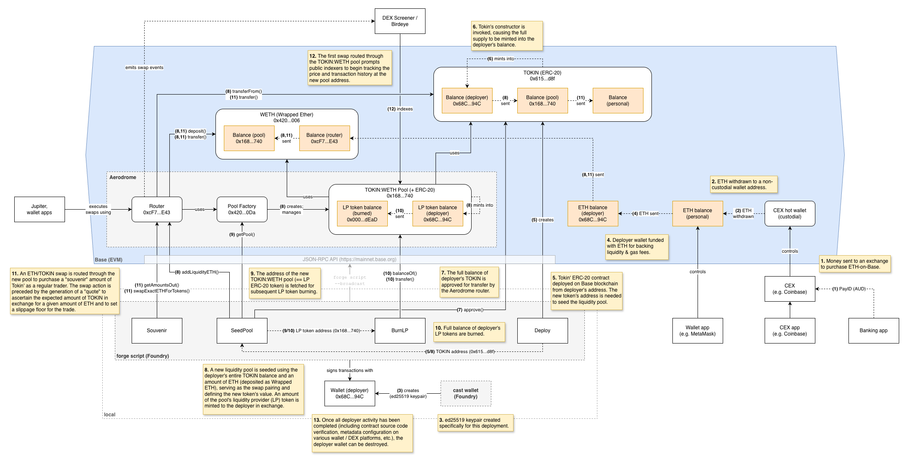

# Deployment summary

**Tokin'** (TOKIN) was launched on the Base (Ethereum L2) blockchain. The detailed build/test/launch process is documented in [runsheet.md](runsheet.md).

## Live addresses

- Token address: [0x615288abCF1B9A08EF6680F0D592B4155D9eEd8f](https://basescan.org/address/0x615288abCF1B9A08EF6680F0D592B4155D9eEd8f)

- Swap pool address: [0x168a0f0f7bE446F67FfE98FfBd98db4251F82740](https://dexscreener.com/base/0x168a0f0f7bE446F67FfE98FfBd98db4251F82740)

- Metadata: https://tokin.pages.dev/tokin-list.json

## Visualisation

## Not in scope

To keep this experiment innocent, avoiding even the remotest possibility of future scrutiny:

- **No marketing**: no website or social media of any kind, including private channels. The token launches in complete obscurity.

- **No recruitment**: no assembling of friends or colleagues to buy for fun, which can be interpreted as market manipulation regardless of intent. Some trading bots are very susceptible to this behaviour.

- **No promise of value**: nothing in the token's on-chain or off-chain presence contains language that could be construed as deceptive.

- **No CEX listing attempts**: some particularly dodgy centralised exchanges may list for an affordable fee, but this is not worth the risk just to enjoy it being made visible to a segment of the crypto community.

- **Wallet separation**: the deployer keypair and all associated activity stays carefully separated from any professional context.